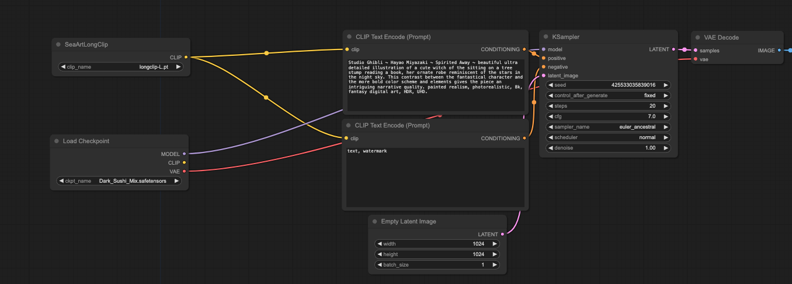
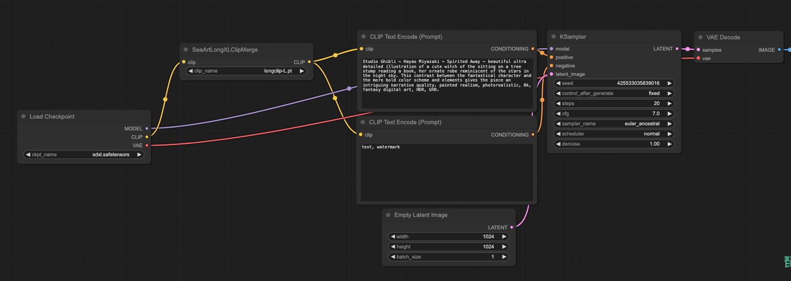
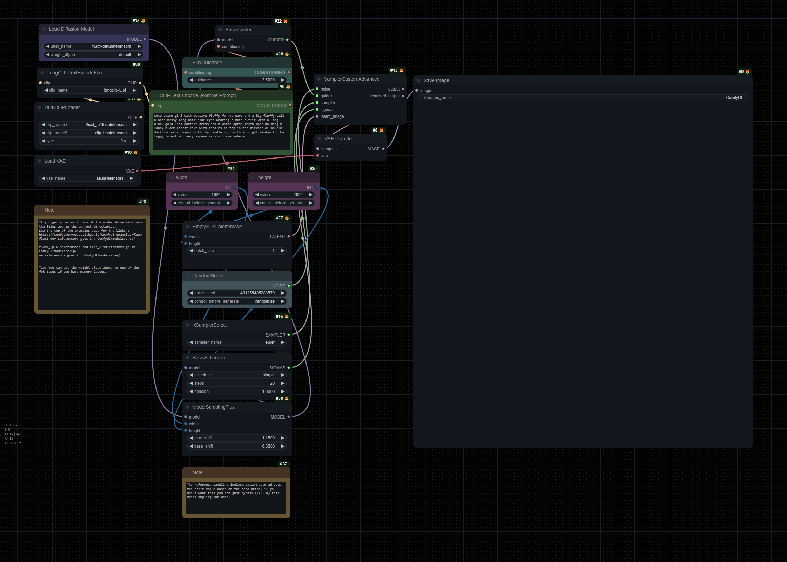

# ComfyUI-Long-CLIP (Flux Suport Now)
This project implements the comfyui for long-clip, currently supporting the replacement of clip-l. For SD1.5, the SeaArtLongClip module can be used to replace the original clip in the model, expanding the token length from 77 to 248. Through testing, we found that long-clip improves the quality of the generated images. As for the SDXL model, since the clip-long model for clip-g has not been released, our processing procedure is as follows: for smaller tokens, we expand them by an integer multiple of the original max_len, and since the last added are pad_tokens, we trim the excess part. Given that clip-g features occupy a larger proportion in SDXL, you may notice more detailed images. Finally, if you like our project, please give us a thumbs up.

Thanks to [zer0int](https://github.com/zer0int)'s work, now long-clip provides support for flux.

## Start
```
git clone https://github.com/comfyanonymous/ComfyUI.git
cd ComfyUI/custom_nodes
git clone git@github.com:SeaArtLab/ComfyUI-Long-CLIP.git
```
Download [LongCLIP-L](https://huggingface.co/BeichenZhang/LongCLIP-L) to models/checkpoints, and thanks to [Long-CLIP](https://github.com/beichenzbc/Long-CLIP/tree/main) for making the weights available. Once the LongCLIP-G weights are released, we will also support them!

## Workflow
We have specifically prepared examples for SD1.5 and SDXL for your use. To simplify the demonstration, our examples are straightforward, and you do not need to install any additional plugins. This plugin also supports operations such as clip-skip.


